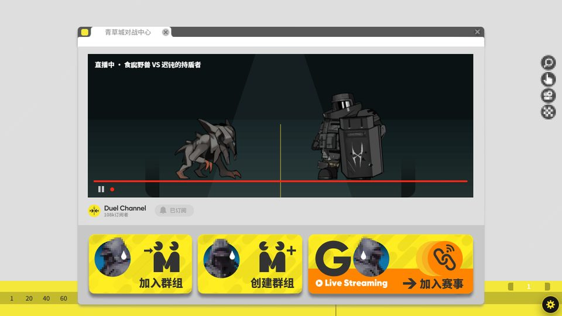
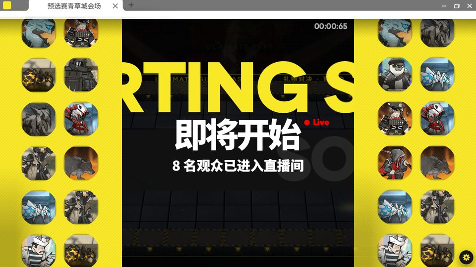
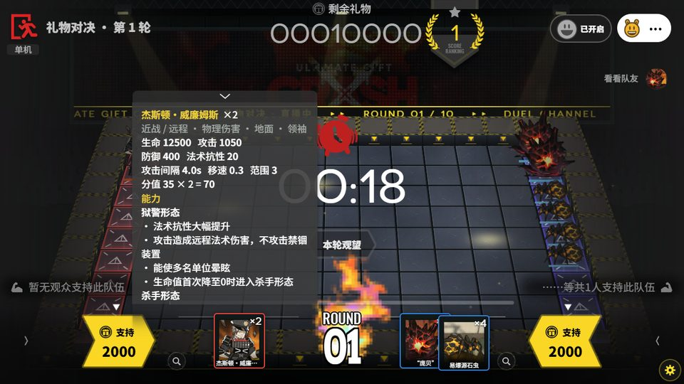
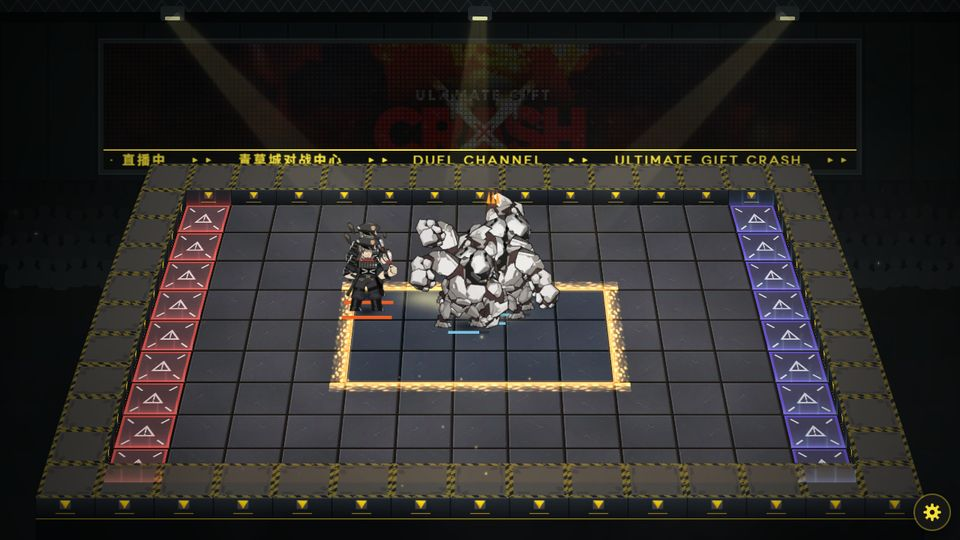
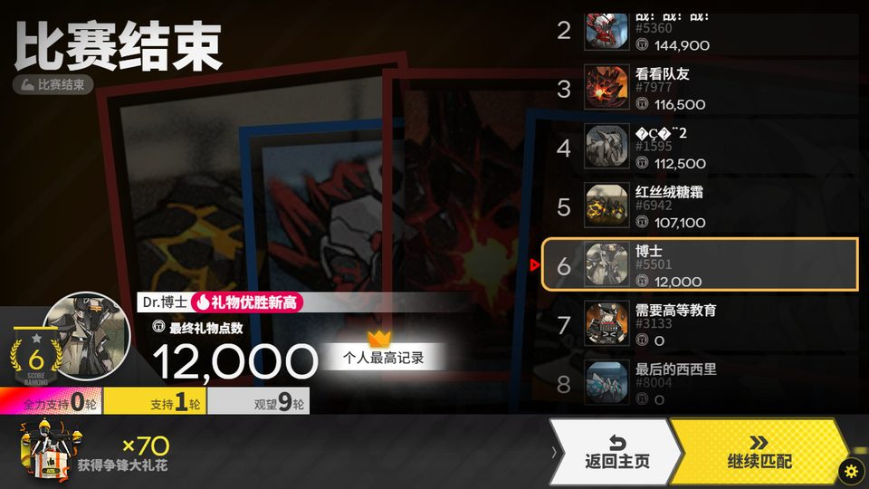

# 争锋频道 · Duel Channel

《明日方舟》限时玩法「争锋频道」中**礼物对决**与**竞猜对决**的**非官方同人复刻**：在浏览器里观看敌人之间的对战，每轮选择你看好的一方——礼物对决里 8 名观众比拼礼物点数，竞猜对决里最多 30 名观众猜到只剩最后一人。可以单机游玩，也可以在本机或局域网开服联机。


[](https://github.com/Cloudnyco/Duel-Channel/actions/workflows/ci.yml)

## 声明

> [!IMPORTANT]
> - 本项目是玩家自制的**非官方同人作品**，与上海鹰角网络科技有限公司（Hypergryph）及其关联方**没有任何关系**，未获其授权或认可。
> - 《明日方舟》及「争锋频道」相关的名称、角色、美术、Spine 模型、界面、音乐、音效、文本与数据等素材，版权归原权利人所有。这些素材**不适用**本项目的 AGPL-3.0 许可证；AGPL 只覆盖本项目自己编写的代码。
> - 仓库收录了页面需要的素材包（`assets/`，从游戏客户端导出），以及由官方数据表生成的数据（`data/`）和截图。它们同样不适用 AGPL，**只能用于非商业用途**。两款显示字体不在仓库中，构建时从公开的字体仓库下载。
> - 仅供学习交流与个人非商业使用。**严禁任何形式的盈利**：售卖、付费分发、收费开服、广告或打赏变现等。
> - 权利人如认为本项目侵犯其权益，请通过 Issue 联系，我们会**立即删除**相关内容。
> - 本项目按「现状」提供，**不提供任何担保**，使用风险自负。完整条款见 [NOTICE.md](NOTICE.md)。

English summary: [below](#english).

| 开始界面 | 浏览器 | 即将开始 |
|---|---|---|
|  |  |  |
| **押注（敌人信息）** | **对战（安全区）** | **最终结算** |
|  |  |  |

## 目录

- [简介](#简介) · [功能一览](#功能一览) · [快速开始](#快速开始) · [联机](#联机)
- [开发与测试](#开发与测试) · [项目结构](#项目结构) · [文档](#文档) · [参与贡献](#参与贡献) · [许可证](#许可证) · [致谢与数据来源](#致谢与数据来源)

## 简介

礼物对决每局 10 轮。每轮场上的两队敌人互相对战，观众在 20 秒内选择支持一方（猜对赢得等同投入的礼物，「全力支持」两倍；也可以观望），礼物归零即被淘汰，最后按礼物点数排名。

竞猜对决最多 30 人。每轮只选一边，选错即淘汰；每人有一次观众保护，前 5 轮里第一次选错时免于淘汰。不限轮数，直到只剩一人，按选对的轮数排名；每轮结束后全场 30 人在同一个榜上。

- **规则和数值对照官方数据**：活动配置（模式、轮次、NPC 观众及其选边策略、常量与文本）、关卡规则、敌人属性与技能都由官方数据表生成；安全区的时机与范围来自客户端的环境预制体；数据表里没有的规则对照 PRTS 核对。具体见 [docs/MECHANICS.md](docs/MECHANICS.md)，所有按推断实现的地方都在那里列出。
- **确定性战斗**：同样的阵容和随机种子，在 Node 和各浏览器里算出逐位相同的结果。联机时服务端先算出结果，客户端用同一份代码重放。
- **界面**：页面用 HTML 重建了活动的 UGUI 界面（锚点布局、九宫格、模板遮罩、形状着色器、旧版动画曲线、UI 粒子、UI Spine），由 PixiJS 绘制对战场地。

## 功能一览

- **完整流程**：开始界面 → 浏览器 → 选择赛事 → 匹配（人数不足时由官方 NPC 补位）或群组房间 → 即将开始 → 每轮押注与对战 → 计分板（竞猜对决：全场一个榜的阶段结算）→ 最终结算。
- **押注界面**：倒计时、支持 / 全力支持 / 观望、其他观众的选择实时出现；放大镜查看敌人信息（本关实际数值、图鉴能力、描述）。
- **对战**：三期全部 113 种敌人（可出场 109 种），每一轮从三期的同号轮次中随机取一个；阵容按 PRTS 整理的官方分配规则生成；每种敌人的技能与天赋按 PRTS 争锋频道选手信息和官方数据实现（嘲讽、元素损伤、寒冷与冻结、屏障、召唤与死亡效果、禁锢与解放、持续施法、领袖的第二形态等），还有蜜果城的奇袭空降、绿藤城的巨型领袖与协同选手；场上可能出现关卡里的装置（障碍物、源石祭坛、弩炮、清债程序、梅什科线圈），押注时就能看到；60 秒后安全区每 20 秒缩小一圈，圈外获得「源石兴奋」并逐秒叠加内伤；战斗打得越久播放越快（最多 3 倍）。
- **表情**：押注和对战时从顶栏打开表情面板，5 个官方表情主题（对战主题和愚人节、源石虫主题）左右翻页，表情以弹幕形式从画面上方飘落（官方的轨道、缓动和缩放参数）；可以一键屏蔽。单机时 NPC 观众也会发表情。
- **联机**：网关 + 多个对战实例；礼物对决和竞猜对决各自的匹配队列（满 8 / 30 人开局，等待超时由 NPC 补位）；6 位邀请码的群组房间（最多 8 / 30 人）；只需开放网关一个端口；断线重连（对局中 30 秒、房间 45 秒内自动接回，刷新页面也能回到比赛）；实时延迟显示；自定义头像（敌人头像或自己的图片）。
- **设置**：右下角齿轮里调整速度、音乐和音效、换曲、快进战斗、查看回合记录、更换头像，并显示当前版本。
- **错误报告**：页面出错时提示并生成报告（版本、浏览器与显卡、对局状态、每轮的阵容与种子、错误与最近的操作记录），可以复制、打开预先填好的 GitHub Issue，或在联机时发送给服务器主机（保存在服务器的 `logs/reports/`）。也可以随时从「设置 → 反馈问题」提交。

## 快速开始

**只是想加入朋友开的服务器？** 不需要下载任何东西，用浏览器打开对方给你的地址即可（第一次约下载 9 MB，之后走浏览器缓存）。

自己开服或单机游玩需要 Node.js 22 或 24，以及 Chrome / Edge 等 Chromium 浏览器。素材包已经在仓库里，clone 下来就能用。

```bash
git clone https://github.com/Cloudnyco/Duel-Channel.git
cd duel-channel
```

1. **一键开服**：Windows 双击 `start.cmd`；Linux / macOS 运行 `./start.sh`。脚本会安装依赖、构建页面（第一次会下载两款字体）、询问是否让局域网里的朋友加入，然后启动服务器、打印要分享的地址并打开浏览器（参数见 [docs/DEPLOY.md](docs/DEPLOY.md)）。

2. **单机**：构建后直接用浏览器打开 `public/duel-flow.html`（单文件，约 16 MB，含素材）。

手动的方式：`npm ci`、`npm run build`、`npm start`。也可以用 Docker 镜像，见 [docs/DEPLOY.md](docs/DEPLOY.md)。

## 联机

```bash
npm start                                   # 网关 :8600 + 3 个对战实例 :8611-8613，只监听本机（玩家只连网关）
```

浏览器打开 <http://127.0.0.1:8600/>，输入昵称后进入频道：

- **加入赛事 → 礼物对决 / 竞猜对决**：进入该模式的匹配队列。满 8 / 30 人立即开局；等待 10 秒后空位由官方 NPC 补齐（NPC 共 28 名）。
- **创建群组**：得到 6 位邀请码，其他人用「加入群组」输入邀请码进房；房主可以勾选 NPC 补位后开局。
- **机器人**：`npm run bots`（7 个机器人进入礼物对决队列）、`node server/bots.mjs --n 29 --mode stand`（29 个进入竞猜对决队列）或 `node server/bots.mjs --n 3 --room <邀请码>`。

局域网联机、Docker 部署、端口与参数、常见问题见 **[docs/DEPLOY.md](docs/DEPLOY.md)**。

## 开发与测试

```bash
npm test             # 战斗模拟（确定性、40 场黄金对局、官方规则）+ 8 个机器人走完一整局的联机端到端测试
npm run check        # 模板与页面脚本、数据文件、素材包完整、未提交字体与构建产物
npm run lint         # ESLint
node tools/golden.mjs   # 规则或数值有意改动后，重新生成黄金对局并审阅 diff
```

CI（GitHub Actions）在 Ubuntu / Windows × Node 22 / 24 上运行检查、测试和服务端冒烟测试，并单独跑 lint 和 Docker 镜像构建；推送 `v*.*.*` 标签时发布 Release（源码包）和服务端镜像（ghcr.io）。

数据由官方数据表生成，需要 [ArknightsGameData](https://github.com/Kengxxiao/ArknightsGameData)：

```bash
node tools/build-data.mjs --gamedata ../ArknightsGameData/zh_CN/gamedata [--models ../Stronghold-Protocol]
```

## 项目结构

```
web/            页面：index.src.html（模板）、src/（界面引擎、粒子、场地与特效、联机、表情、流程、素材包加载）、fx-map.json
shared/sim.js   战斗模拟、阵容生成、NPC 选边、结算——页面和服务端共用
server/         网关（页面、大厅、匹配、群组房间）、对战实例、比赛引擎、启动器、机器人
data/           由官方数据表生成的活动配置与敌人数据（不适用 AGPL）
tools/          一键开服、构建页面、生成数据、黄金对局、静态检查
start.cmd / start.sh   一键开服（Windows / Linux、macOS），见 docs/DEPLOY.md
test/           node --test 测试
docs/           部署、素材、机制、架构
```

## 文档

- [docs/DEPLOY.md](docs/DEPLOY.md)：部署与联机指南
- [docs/ASSETS.md](docs/ASSETS.md)：素材包的内容与格式
- [docs/MECHANICS.md](docs/MECHANICS.md)：规则与数值的官方来源、按推断实现的部分
- [docs/ARCHITECTURE.md](docs/ARCHITECTURE.md)：页面引擎、场地、模拟与服务端的结构
- [CHANGELOG.md](CHANGELOG.md) · [CONTRIBUTING.md](CONTRIBUTING.md)（Issue 与 Pull Request 标准）· [SECURITY.md](SECURITY.md)
- 提问与讨论：[Discussions](../../discussions)

## 参与贡献

- 报告 Bug、指出与官方不一致的规则、提出功能建议：开 [Issue](../../issues/new/choose)，按模板填写。
- 使用、部署求助和想法讨论：[Discussions](../../discussions)。
- 提交代码：先读 [CONTRIBUTING.md](CONTRIBUTING.md)，PR 按模板填写，CI 全部通过后合并。
- 请遵守 [行为准则](CODE_OF_CONDUCT.md)。

## 许可证

本项目自己编写的代码与文档以 **GNU Affero 通用公共许可证第 3 版或更新版本**（AGPL-3.0-or-later）发布，全文见 [LICENSE](LICENSE)。按 AGPL 第 13 条，如果你修改后通过网络向他人提供服务，需要向这些用户提供你修改后的源代码（开始界面页脚的「源代码」链接可改为你的仓库）。

游戏素材与数据不在授权范围内，仅限非商业使用，见 [NOTICE.md](NOTICE.md)；第三方库见 [THIRD-PARTY-NOTICES.md](THIRD-PARTY-NOTICES.md)。

## 致谢与数据来源

- 活动配置、关卡、敌人数据与图鉴：[Kengxxiao/ArknightsGameData](https://github.com/Kengxxiao/ArknightsGameData)
- 规则说明：[PRTS 维基 · 争锋频道](https://prts.wiki/w/%E4%BA%89%E9%94%8B%E9%A2%91%E9%81%93)
- 敌人 Spine 模型与头像的获取流程：[Stronghold Protocol](https://github.com/sganggs/Stronghold-Protocol)
- 渲染：[PixiJS](https://pixijs.com/)、[pixi-spine](https://github.com/pixijs/spine)

## English

**Duel Channel** is an unofficial fan re-creation of the *Gift Duel* and *Guess Duel* modes of Arknights' limited event *Duel Channel*: watch enemies fight, back a side each round, and outlast seven other viewers (gifts) or up to twenty-nine (last one standing). It plays offline in one HTML file or online through a small Node.js server (gateway + battle instances, deterministic battles replayed by every client).

It is not affiliated with or endorsed by Hypergryph. The repository includes the asset pack the page needs (`assets/`, exported from the game client); like the game data, it is not covered by the AGPL and may be used for **non-commercial purposes only** (NOTICE.md). Clone it and run `start.cmd` (Windows) or `./start.sh` (Linux / macOS). The code is AGPL-3.0-or-later.
